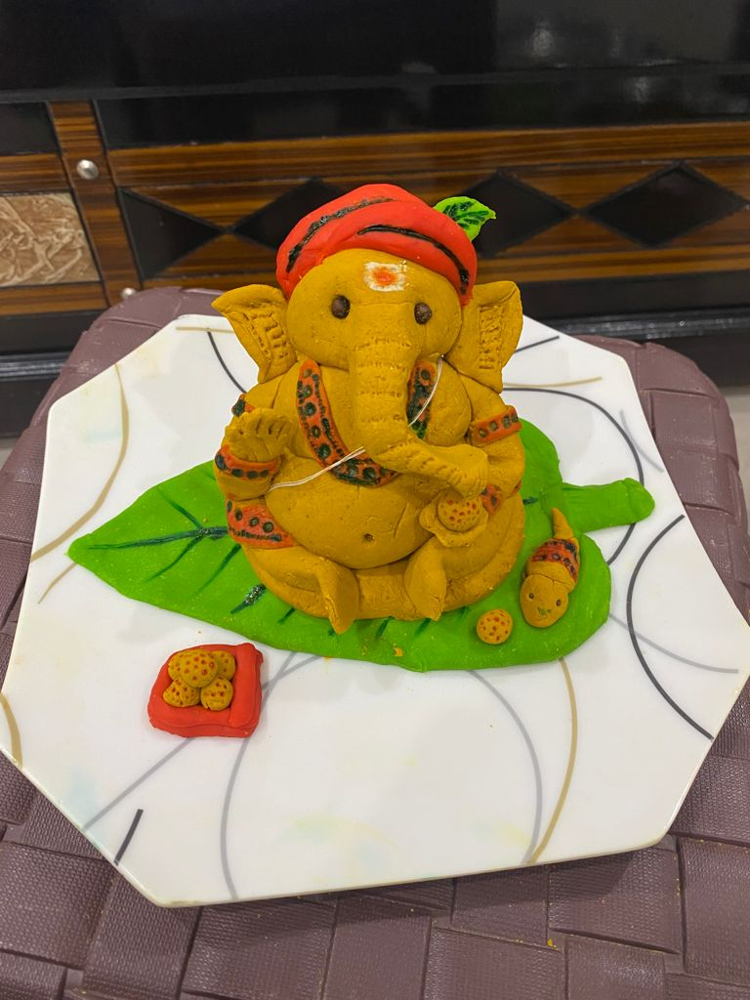
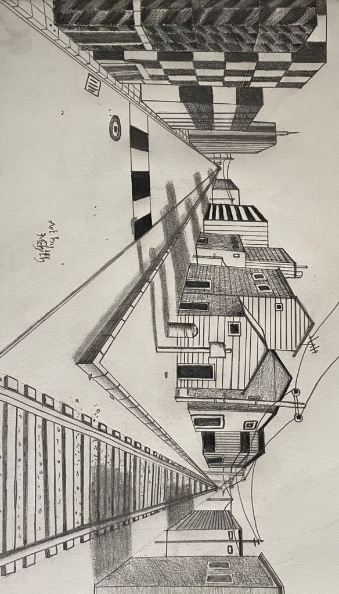
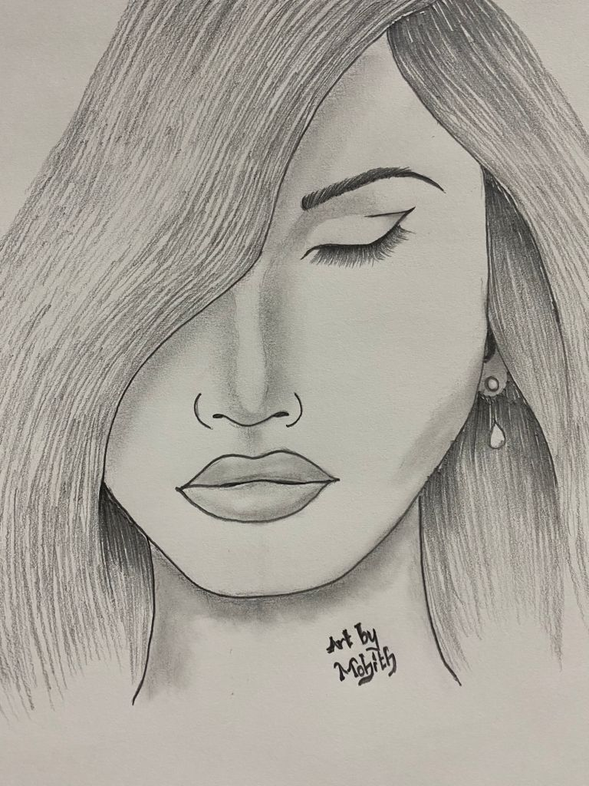
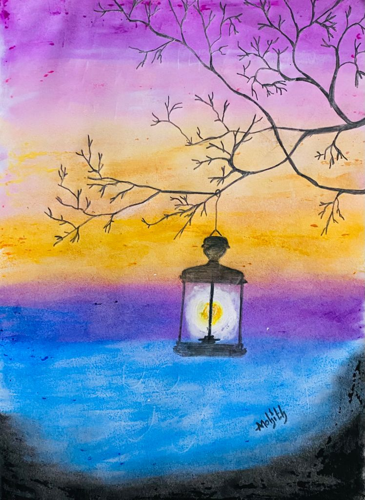
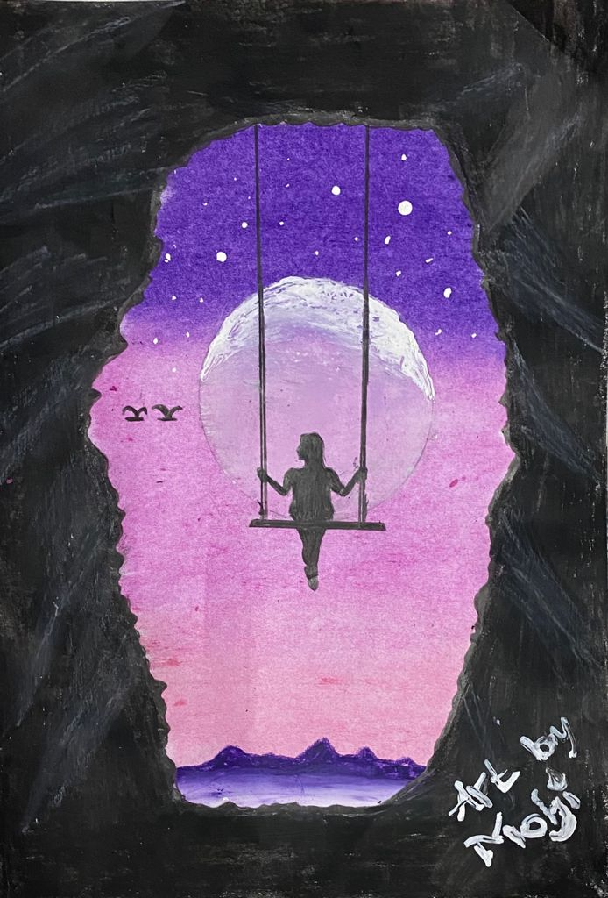

### Hi there 👋

<!--
**vanamamohith/vanamamohith** is a ✨ _special_ ✨ repository because its `README.md` (this file) appears on your GitHub profile.

Here are some ideas to get you started:

- 🔭 I’m currently working on ...
- 🌱 I’m currently learning ...
- 👯 I’m looking to collaborate on ...
- 🤔 I’m looking for help with ...
- 💬 Ask me about ...
- 📫 How to reach me: ...
- 😄 Pronouns: ...
- ⚡ Fun fact: ...
-->
#### I am very passionate about Technology, So after my undergraduation I worked as a Developer. I want to gain more knowledge in Technology, So I took Computer Science in Master's at Northwest Missouri State University and want to be as a Full Stack Developer.

#### Coming to my Acitivities, I love playing Badminton and sometimes I do Art. I have few collections of my pencil art, Clay art and Crayon art.
## Clay Art 

## Pencil art 

## Crayon Art 

---

